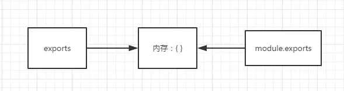

# es6 和 node 

    require: node 和 es6 都支持的引入
    export/import : 只有es6 支持的导出引入
    module.exports/exports: 只有 node 支持的导出
    
##node模块
- Node里面的模块系统遵循的是 CommonJS规范
- CommonJS定义的模块分为：模块标识( module)、模块定义( exports) 、模块引用( require)
        
        exports 和 module.exports
        node执行一个文件时，会给这个文件内生成一个 exports和 module对象，而 module又有一个 exports属性
        
        关系如下图，都指向一块{}内存区域
        exports = module.exports = {};
        exports ==========>  内存{}  <=========== module.exports
        
    
    
- 例子
<pre>
    //utils.js
    let a = 100;
    console.log(module.exports); // 能打印出结果为：{}
    console.log(exports); //能打印出结果为：{}
    exports.a = 200; //帮 module.exports 的内容给改成 {a : 200}
    exports = '指向其他内存区'; //这里把exports的指向指走
    
    //test.js
    var a = require('/utils');
    console.log(a); // 打印为 {a : 200} 
</pre>
    从上面可以看出，其实 require导出的内容是 module.exports的指向的内存块内容，并不是 exports的。
    简而言之，区分他们之间的区别就是 exports 只是 module.exports的引用，辅助后者添加内容用的。
    
    为了避免糊涂，尽量都用 module.exports 导出，然后用 require导入
    
##ES中的模块导出导入

- export 和 export default 区别

        - export与export default均可用于导出常量、函数、文件、模块等
        - 在一个文件或模块中，export、import可以有多个，export default仅有一个
        - 通过export方式导出，在导入时要加{ }，export default则不需要
        - export能直接导出变量表达式，export default不行。

- 代码验证
            
         testEs6Export.js
         index.js

    
     

